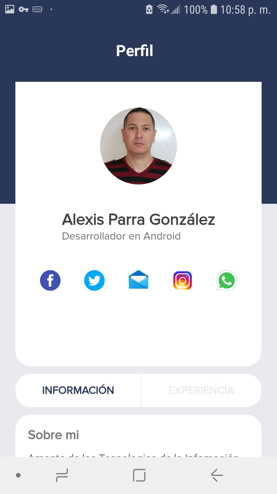

# SampleProfileUi

Profile Ui For Android Material Design XML, Moder Look

## Getting Started

Just Download it and open with Android Studio that's it.

### Prerequisites

Need Android Studio

## Built With

* [CardView](https://developer.android.com/guide/topics/ui/layout/cardview) - Used to give circular border to the Images
* [Maven](https://maven.apache.org/) - Dependency Management
* [Flaticon](https://flaticon.com) - Used to get amzazing icons

